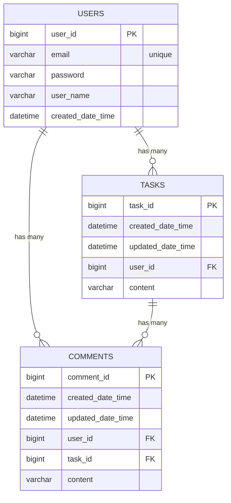

# 1. Scheduler 개요
일정 관리 앱의 백엔드 스프링 부트 프로젝트입니다.

 

# 2. 기능
- **유저 CRUD**
- **일정 CRUD**
- **댓글 CRUD**

 

# 3. 기간
24/12/16 - 24/12/19

 

# 4. 만든 사람
### [cnux9](https://github.com/cnux9)

 

# 5. API Documentation
## Users 관련 API

| HTTP 메서드 | 엔드포인트            | 설명                           | 상태코드     | 요청 내용                                   | 응답 내용                       |
|-------------|-----------------------|--------------------------------|--------------|----------------------------------------------|----------------------------------|
| POST        | `/users`             | 새로운 유저를 생성한다.        | 201 Created  | **Request Body**: user_name, email            | 생성된 유저의 ID, 정보, 생성일시 |
| GET         | `/users/{userId}`    | 특정 유저 정보를 조회한다.     | 200 OK       | 없음                                         | 해당 유저의 상세 정보            |
| GET         | `/users`             | 여러 유저를 조회한다.          | 200 OK       | 없음                                         | 유저 목록                        |
| PUT         | `/users/{userId}`    | 특정 유저 정보를 수정한다.     | 200 OK       | **Request Body**: user_name, email            | 수정된 유저의 상세 정보          |
| DELETE      | `/users/{userId}`    | 특정 유저를 삭제한다.          | 200 OK       | 없음                                         | 없음(상태코드로만 응답)          |

## Tasks 관련 API

아래 예시는 질문자가 원하는 문서 형식의 예시에 해당하는 Tasks 엔드포인트에 대한 문서입니다.

| HTTP 메서드 | 엔드포인트          | 설명                                     | 상태코드       | 요청 내용                                                                             | 응답 내용                                 |
|-------------|---------------------|------------------------------------------|----------------|----------------------------------------------------------------------------------------|--------------------------------------------|
| POST        | `/tasks`            | 새로운 할 일을 생성한다.                 | 201 Created    | **Request Body**: user_id, password, content                                            | 생성된 할 일의 ID, 유저 정보, 생성일시 등 |
| GET         | `/tasks/{taskId}`   | 특정 ID의 할 일을 조회한다.              | 200 OK         | 없음                                                                                   | 해당 할 일의 상세 정보                    |
| GET         | `/tasks`            | 여러 할 일을 조회한다.                   | 200 OK         | 없음                                                                                     | 할 일 목록                            |
| PUT         | `/tasks/{taskId}`   | 특정 ID의 할 일을 수정한다.              | 200 OK         | **Request Body**: password, 수정할 content                                             | 수정된 할 일의 상세 정보                  |
| DELETE      | `/tasks/{taskId}`   | 특정 ID의 할 일을 삭제한다.              | 200 OK         | **Query Params**: password                                                             | 없음 (상태코드로만 응답)                  |

## Comments 관련 API

| HTTP 메서드 | 엔드포인트              | 설명                     | 상태코드    | 요청 내용                      | 응답 내용                      |
|-------------|-------------------------|--------------------------|-------------|--------------------------------|---------------------------------|
| POST        | `/comments`            | 새로운 댓글을 생성한다.  | 201 Created | **Request Body**: content 등    | 생성된 댓글의 ID, 정보, 생성일시 |
| GET         | `/comments/{commentId}`| 특정 댓글을 조회한다.    | 200 OK      | 없음                           | 해당 댓글의 상세 정보            |
| GET         | `/comments`            | 여러 댓글을 조회한다.    | 200 OK      | **Query Params**: 필요시 추가  | 댓글 목록                        |
| PUT         | `/comments/{commentId}`| 특정 댓글을 수정한다.    | 200 OK      | **Request Body**: content 등    | 수정된 댓글의 상세 정보          |
| DELETE      | `/comments/{commentId}`| 특정 댓글을 삭제한다.    | 200 OK      | 없음                           | 없음(상태코드로만 응답)          |
 

# 6. 데이터베이스 ERD

 
